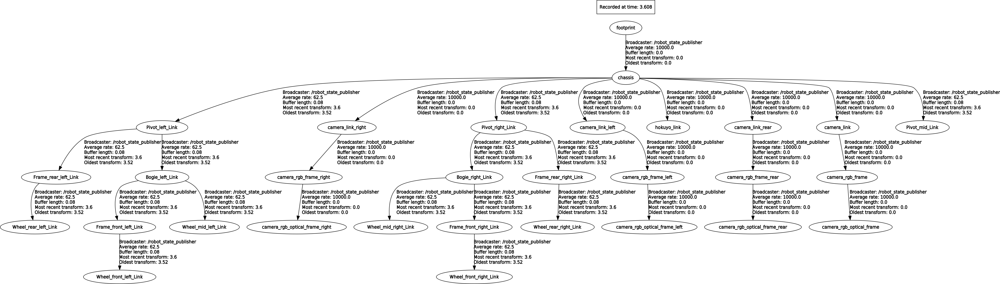
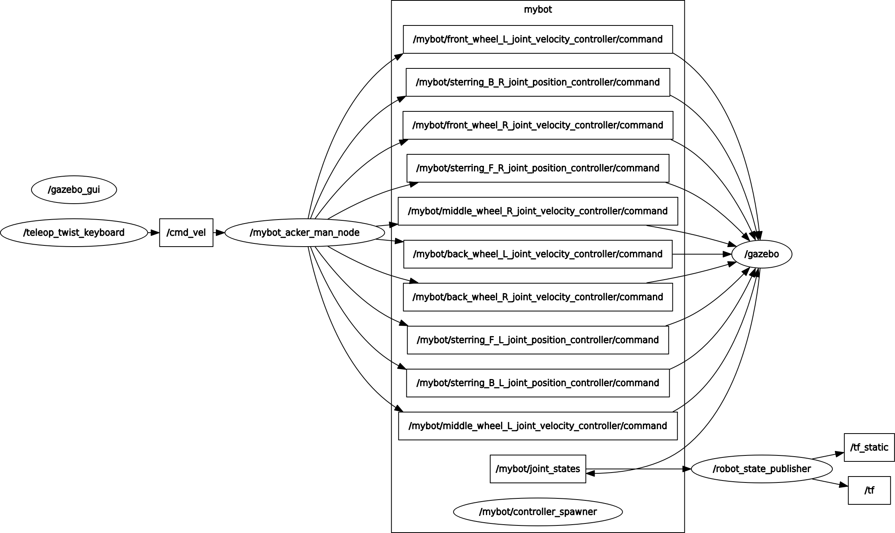

## BeetleBot: 6-wheel mobile robot with the Rocker-bogie mechanism

### System and softwares information

- Ubuntu 16.04/18.04

- ROS Kinetic/Medolic

- Gazebo 7/8

### TF_Tree

### rqt_graph

### Build BeetleBot
    $ cd navigation/beetlebot

    $ catkin_make

    $ . devel/setup.bash

    $ roslaunch beetlebot_gazebo beetlebot_world.launch

    (Wait until the world finishes loading in the gazebo)

    $ roslaunch beetlebot_gazebo load_robot.launch

### Control robot with keyboard:

    $ cd navigation/beetlebot
    $ . devel/setup.bash
    $ cd src/beetlebot/beetlebot_control/scripts
    $ python keyboard_controller.py

key| command|
---|---|
w|move forward
a| turn left|
d| turn right|
s| move backward|
space|stop
r| rotate delivery-robot clockwise
f| rotate delivery-robot counter-clockwise
i| increase velocity by 1
k| decrease velocity by 1
j| decrease turning radius by 10 or increase turning degree
l| increase turning radius by 10 or decrease turning degree

Ref: [aioz-ai](https://github.com/aioz-ai/IROS20_NMFNet)